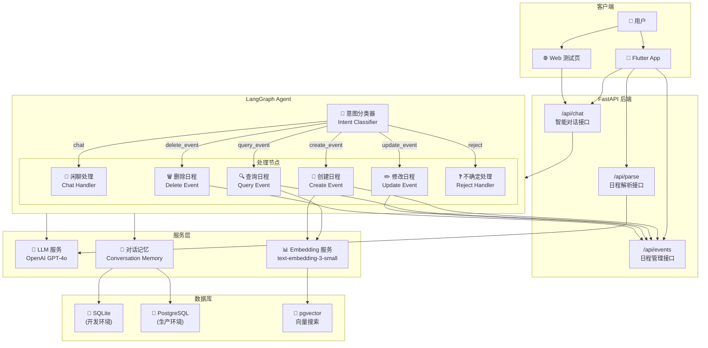
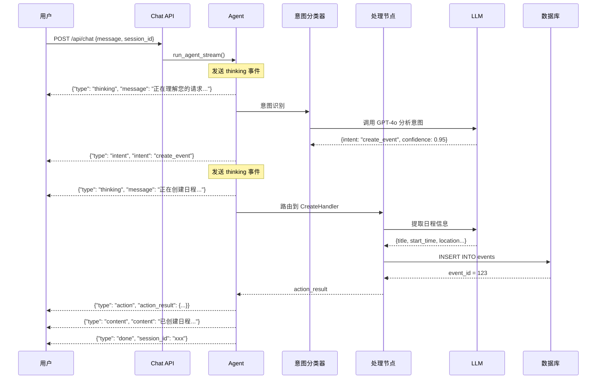
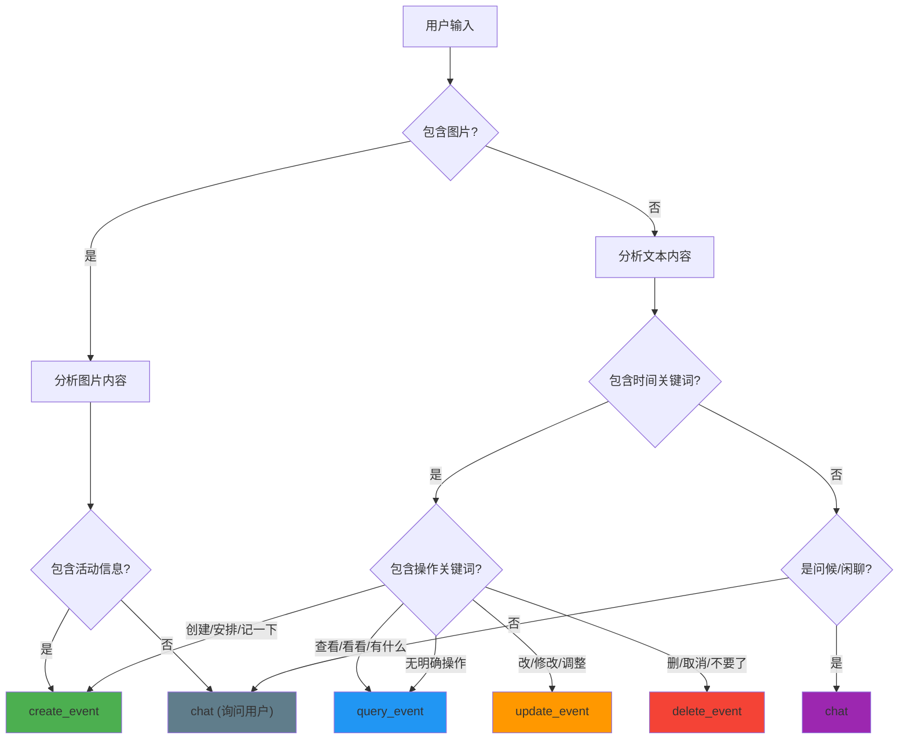

# FollowUP Backend

智能日程助手后端服务，基于 FastAPI + LangGraph 构建。

## 架构概览

### Agent 架构图



### Agent 流程图



### 意图分类决策树



## 技术栈

| 层级 | 技术 |
|------|------|
| 框架 | FastAPI |
| 数据库 | SQLite (开发) / PostgreSQL (生产) |
| ORM | SQLAlchemy |
| LLM | LangChain + LangGraph + OpenAI |
| 向量搜索 | pgvector |

## 快速开始

```bash
# 安装依赖
pip install -r requirements.txt

# 配置环境变量
cp .env.example .env
# 编辑 .env 设置 OPENAI_API_KEY

# 启动开发服务器
python main.py
```

## API 端点

| 方法 | 端点 | 说明 |
|------|------|------|
| POST | `/api/chat` | 智能对话（支持流式） |
| POST | `/api/parse` | 解析文本/图片 |
| GET | `/api/events` | 获取日程列表 |
| GET | `/api/events/search` | 语义搜索日程 |
| POST | `/api/events` | 创建日程 |
| PUT | `/api/events/{id}` | 更新日程 |
| DELETE | `/api/events/{id}` | 删除日程 |

## 测试

```bash
# 运行测试
pytest

# 使用 Web 测试页面
# 启动服务器后访问 tests/chat_test.html
```

## 相关文档

- [AGENTS.md](AGENTS.md) - 开发规则和指南
- [CHAT_STREAMING.md](CHAT_STREAMING.md) - 流式响应文档
- [DATABASE.md](DATABASE.md) - 数据库设计文档
