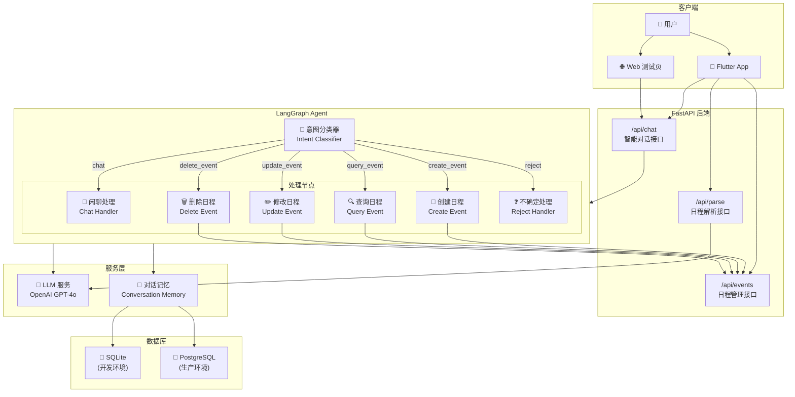

# FollowUP Backend

智能日程助手后端服务，基于 FastAPI + LangGraph 构建。

## 架构概览

### Agent 架构图



## 技术栈

| 层级 | 技术 |
|------|------|
| 框架 | FastAPI |
| 数据库 | SQLite (开发) / PostgreSQL (生产) |
| ORM | SQLAlchemy |
| LLM | LangChain + LangGraph + OpenAI |

## 快速开始

```bash
# 安装依赖
pip install -r requirements.txt

# 配置环境变量
cp .env.example .env
# 编辑 .env 设置 OPENAI_API_KEY

# 启动开发服务器
python main.py
```

## API 端点

| 方法 | 端点 | 说明 |
|------|------|------|
| POST | `/api/chat` | 智能对话（支持流式） |
| POST | `/api/parse` | 解析文本/图片 |
| GET | `/api/events` | 获取日程列表 |
| GET | `/api/events/search` | 搜索日程 |
| POST | `/api/events` | 创建日程 |
| PUT | `/api/events/{id}` | 更新日程 |
| DELETE | `/api/events/{id}` | 删除日程 |

## 数据库配置

### 开发环境 (SQLite)

默认使用 SQLite，无需额外配置：

```bash
# 使用默认配置
python main.py
```

### 生产环境 (PostgreSQL)

通过环境变量 `DATABASE_URL` 配置：

```bash
export DATABASE_URL="postgresql://用户名:密码@主机:端口/数据库名"
```

### 数据库模型

**User（用户）**
- `id`, `username`, `password`, `created_at`

**Event（活动）**
- `id`, `user_id`, `title`, `start_time`, `end_time`, `location`, `description`
- `source_type`, `source_content`, `source_thumbnail`, `is_followed`, `created_at`

**Conversation（对话）**
- `id`, `session_id`, `user_id`, `messages`, `created_at`, `updated_at`

### 预置用户

| Username | Password/Token |
|----------|----------------|
| alice | alice123 |
| bob | bob123 |
| jane | jane123 |
| xiao | xiao123 |
| moni | moni123 |

### 数据库迁移

应用启动时会自动运行迁移。如需手动迁移：

```bash
python migrate_db.py
```

## 日志配置

### 环境变量

```bash
LOG_LEVEL=INFO              # DEBUG, INFO, WARNING, ERROR
LOG_FILE_ENABLED=true       # 是否写入文件
```

### 日志位置

- 控制台：实时输出
- 文件：`logs/app_YYYYMMDD.log`

## 测试

```bash
# 运行测试
pytest

# 使用 Web 测试页面
# 启动服务器后访问 tests/chat_test.html
```

## 相关文档

- [AGENTS.md](AGENTS.md) - 开发规则和指南
- [CHAT_STREAMING.md](CHAT_STREAMING.md) - 流式响应文档
