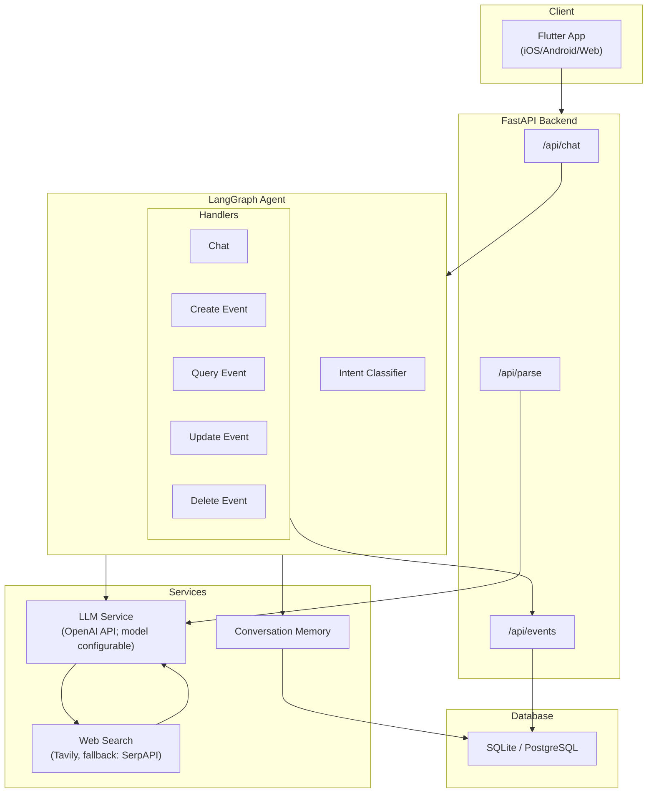
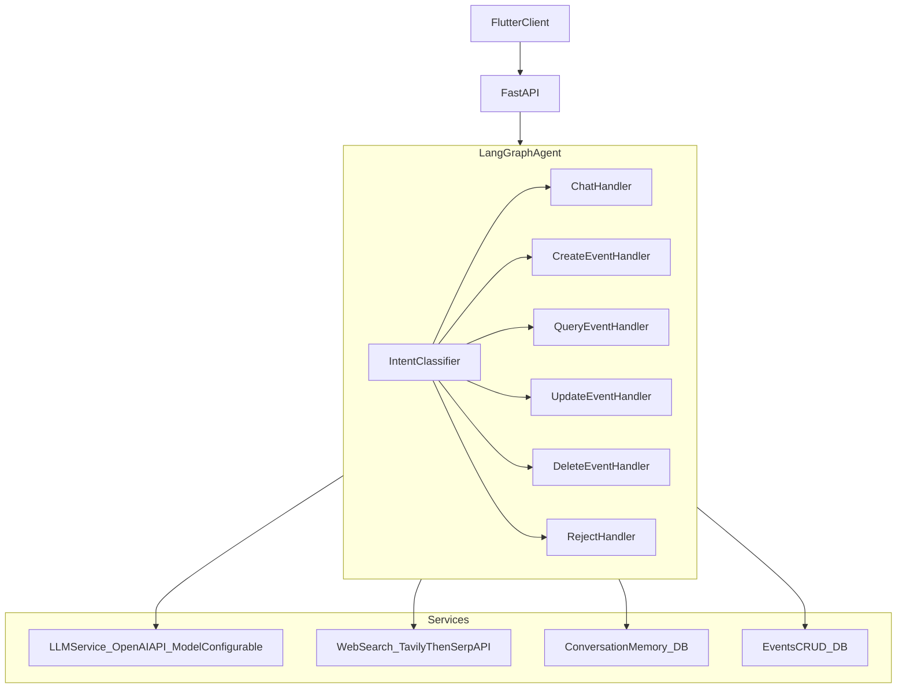

# FollowUP

<!--  -->

> **Never miss a moment that matters.**

FollowUP is an intelligent calendar assistant that helps you achieve Work-Life Balance by automatically extracting events from text, images, and voice inputs. Every meeting, every gathering, every concert deserves your presence.


**Capture any event. Add to calendar. Stay on track.**

---

## Tech Stack

| Layer | Technology |
|-------|------------|
| **Frontend** | Flutter (iOS / Android / Web) |
| **Backend** | Python FastAPI + SQLAlchemy |
| **AI/LLM** | LangChain + LangGraph + OpenAI API (model configurable) |
| **Database** | SQLite (dev) / PostgreSQL (prod) |
| **Hosting** | Railway |

---

## Features

- **Multi-modal Input** — Paste text, upload images (posters, screenshots), or describe events in natural language
- **AI-Powered Extraction** — LLM automatically extracts event details (title, time, location, description)
- **Intelligent Chat Agent** — LangGraph-based agent with intent recognition for creating, querying, updating, and deleting events
- **ICS Calendar Export** — Generate standard iCalendar files compatible with all major calendar apps
- **Event Management** — Full CRUD operations for your events with follow/unfollow functionality
- **Multi-language Support** — English, German, and Chinese interface
- **Streaming Responses** — Real-time chat streaming for better user experience

---

## Architecture



**Web search enrichment**: When event info is incomplete (e.g., blurry posters), the backend can enrich details via web search, using **Tavily first** and falling back to **SerpAPI**.

---

## Details

Add anything else you want to share: architecture diagrams, screenshots, challenges faced, future plans, etc.

### Agent architecture



### Challenges faced

1. **Users take random photos** (low-signal or irrelevant images)
   - We handle this with a **relevance-first flow**: extract what we can, then ask a **single clarification question** when critical fields (time/location) are missing.
   - If the content is not event-related, we **fail safely** (no event is created) and guide the user to provide a better poster/screenshot or add a short note.

2. **Long-running context** (multi-turn conversations over time)
   - We store conversation history per `session_id` in the database.
   - For each request, we use a **sliding window** of recent turns (e.g., the last 10 messages) to keep prompts bounded.
   - Future improvement: **summarize older context** into a compact memory when sessions get long.

3. **Multiple images per request**
   - The API supports both `image_base64` (single) and `images_base64` (multiple) for batch processing.
   - We parse images in batch when possible, and fall back to per-image parsing to keep thumbnails and results consistent.
   - Future improvement: better **event-to-image attribution** and stronger **deduplication** across images.

### Future plans

- **Voice**: voice input (STT) + voice editing.
- **Real follow up**: a background bot that tracks event progress (ticket sales, time changes, new info) and notifies users.
- **Light social**: share events (invites, links, ICS) with friends.
- **Small groups**: family or group activities with shared/limited collaboration.

---

## How to Run

### Prerequisites

- Python 3.11+
- OpenAI API Key
- Flutter 3.x (optional; only needed to rebuild the embedded Web UI or run the app natively)

### Backend

```bash
# Navigate to backend directory
cd Backend

# Install dependencies
pip install -r requirements.txt

# Configure environment variables
cp .env.example .env
# Edit .env and add your OPENAI_API_KEY

# Run the development server
python main.py
```

Open the Web UI at `http://localhost:8000`.

The API will be available at `http://localhost:8000/api/*`. View API docs at `http://localhost:8000/docs`.

### Frontend

The backend can serve the Flutter Web build directly (recommended for demo):

```bash
# Build Flutter Web (outputs to Frontend/followup/build/web)
cd Frontend/followup
flutter build web

# Then run the backend and open:
# http://localhost:8000
```

If you want to run Flutter directly (native app development or hot reload):

```bash
# Navigate to frontend directory
cd Frontend/followup

# Install dependencies
flutter pub get

# Run the app
flutter run

# Build for web
flutter build web
```

---

## API Endpoints

| Method | Endpoint | Description |
|--------|----------|-------------|
| POST | `/api/auth/login` | User login, returns JWT token |
| GET | `/api/user/me` | Get current user info |
| POST | `/api/chat` | Intelligent chat agent (supports streaming) |
| DELETE | `/api/chat/{session_id}` | Clear conversation history |
| POST | `/api/parse` | Parse text/image to extract events |
| GET | `/api/events` | List user's events |
| GET | `/api/events/search` | Search events |
| POST | `/api/events` | Create new event |
| PUT | `/api/events/{id}` | Update event |
| DELETE | `/api/events/{id}` | Delete event |
| GET | `/api/events/{id}/ics` | Download ICS calendar file |
| GET | `/api/health` | Health check |

---

## Preset Users (Development)

For quick testing, use these preset accounts:

| Username | Password |
|----------|----------|
| alice | alice123 |
| bob | bob123 |
| jane | jane123 |
| xiao | xiao123 |
| moni | moni123 |

---

## Project Structure

```
follow_up/
├── Backend/
│   ├── main.py              # FastAPI entry point
│   ├── routers/             # API route handlers
│   │   ├── auth.py          # Authentication
│   │   ├── chat.py          # Intelligent chat agent
│   │   ├── events.py        # Event CRUD
│   │   └── parse.py         # Text/image parsing
│   ├── services/
│   │   ├── llm_service.py   # LangChain integration
│   │   └── agent/           # LangGraph agent
│   └── models.py            # Database models
├── Frontend/
│   └── followup/            # Flutter application
│       ├── lib/
│       │   ├── pages/       # UI screens
│       │   ├── services/    # API services
│       │   └── providers/   # State management
│       └── pubspec.yaml
└── Docs/                    # Documentation
```

---

## Documentation

- [Backend README](Backend/README.md) — Backend architecture and API details
- [Backend Development Rules](Backend/AGENTS.md) — Development guidelines
- [Product Specification](Docs/production.md) — Full product documentation

---

## License

This project was created for the Cursor 2-Day AI Hackathon (Hamburg, 2026).

---

*Built with Cursor AI*
